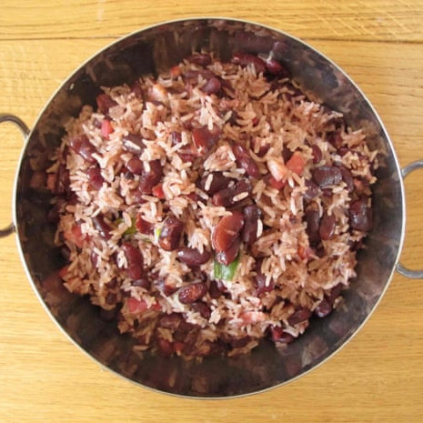

# Rice dishes `r emo::ji("rice")` {-}

##  Rice and peas {-}
Based on the [Guardian pefect](https://www.theguardian.com/lifeandstyle/2015/oct/08/how-to-make-the-perfect-rice-and-peas)

* 1 onion
* 1 garlic clove
* 50g creamed coconut
* 200g rice
* 450ml stock
* 200g cooked kidney beans
* 1 chilli (whole, removed at end)
* 1 sprig of thyme  (whole, removed at end)
* 1/4 tsp all spice berry  (whole, removed at end)

Fry onion and garlic. Add everything else. Bring to boil, cover and cook for 20/25 min. 

## Leek and Parmesan Risotto {-}

- 4 spring onions
- 2 leeks chopped
- 2 garlic cloves
- 150g arborio rice
- 1 glass white wine
- 750 veg stock

Bring stock to simmer. Heat pan with butter and oil, cook veg for 5min. Add rice, stir to coat. Add wine and bubble until reduced. Add stock a little at a time until rice is tender and ooooozy. Serve with parmesan.

