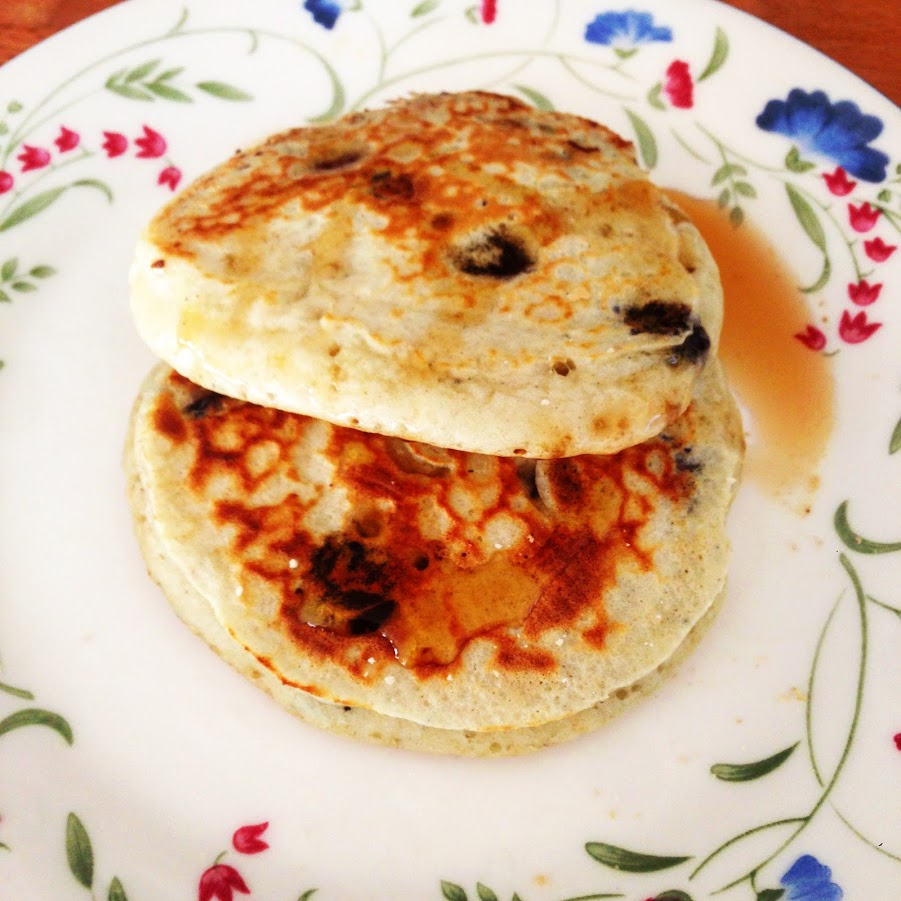
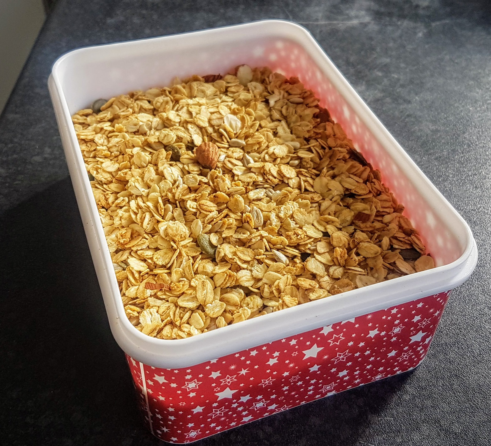

# Breakfast 🥞{-}

## Blueberry pancakes {-}
Simon Rimmer

* 200g self-raising flour
* 1 tsp bicarbonate of soda
* 50g caster sugar
* 1 egg
* 50g melted butter
* 250ml milk
* 125g cottage cheese
* 225g blueberries
* 15g unsalted butter

Mix the flour, bicarbonate of soda and sugar together in a bowl. In a separate bowl combine one egg with the 50g melted butter, milk and cottage cheese then add this to the flour mix and stir together to make a batter. Stir in the blueberries. Lightly oil a frying pan and preheat over a medium heat. Spoon a small ladleful of the pancake batter into the pan and cook for one minute on each side, until golden.

## Granola {-}

* 250g oats
* 30g coconut oil
* 60g honey
* 50g mixed nuts
* 50g seeds
* 50g dried fruit

Heat the oven to 150C. Melt the fat in the microwave. Mix  with the dry ingredients, apart from the fruit, in a large bowl.
Spread out on the baking sheet and bake for about 30-35 minutes until golden, stirring occasionally.

